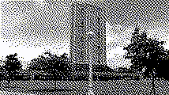

# dither_some
Dither images and videos using various algorithms.

```
Usage: dither_some [OPTIONS] <INPUT> <OUTPUT> <ALGORITHM>

Commands:
  atkinson  Apply Atkinson dithering algorithm
  fs-color  Apply colored Floyd-Steinberg dithering algorithm
  help      Print this message or the help of the given subcommand(s)

Arguments:
  <INPUT>   Path of video to dither
  <OUTPUT>  Path where to save dithered video

Options:
      --dither-res <DITHER_RES>  The actual resolution of the image when it is dithered. Defaults to input resolution
      --output-res <OUTPUT_RES>  The output resolution. Defaults to input resolution
  -h, --help                     Print help
  -V, --version                  Print version
```

## Samples

<table>
  <tr>
    <td align="center">
      <br>
      <sub>Atkinson dithering (2-color)</sub>
    </td>
    <td align="center">
      <br>
      <sub>Floyd–Steinberg dithering (4-color per channel)</sub>
    </td>
  </tr>
</table>
